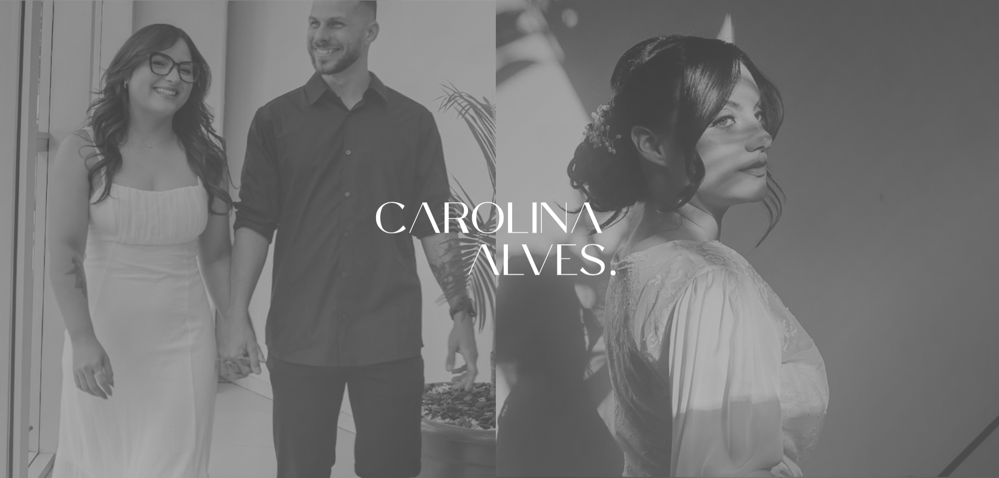
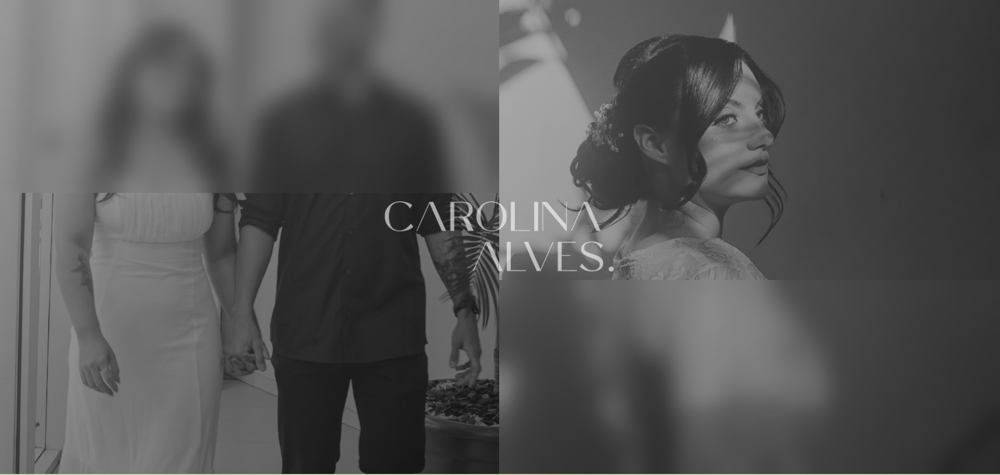
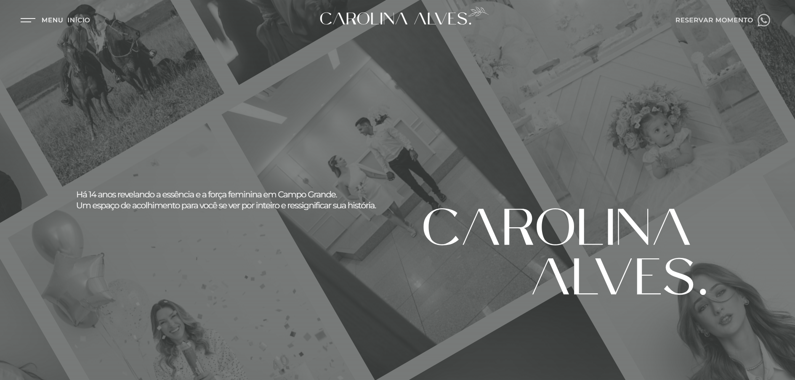
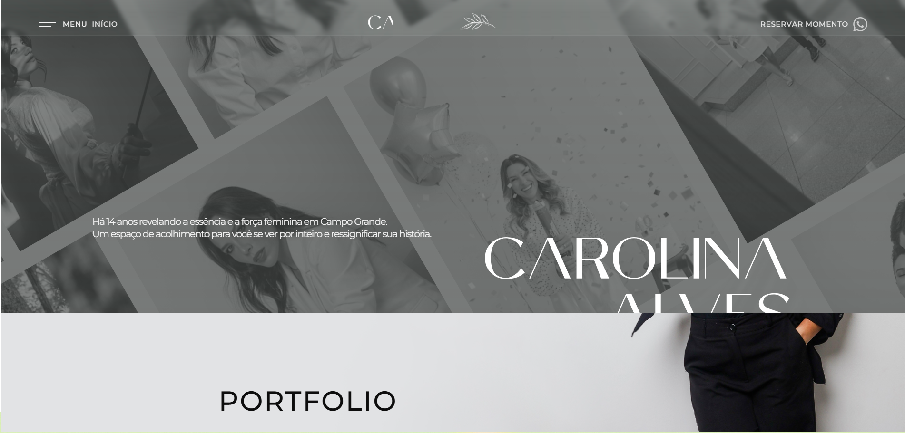

# Carolina Alves — Fotografia Profissional


Landing page profissional para Carolina Alves Fotografia — scroll suave com parallax, glassmorphism e animações avançadas. Conteúdo gerenciado via Prismic CMS.

---

## 🖼️ Screenshots

### Preloader — Fase 1 (glassBreathe)



O preloader inicia com dois painéis de vidro fosco que "respiram" via `backdrop-filter: blur()` pulsante, revelando fotos em preto e branco.

### Preloader — Fase 2 (split screen)



Os painéis deslizam em direções opostas, exibindo uma esteira vertical de imagens do portfólio com parallax interno.

### Homepage



Header com glassmorphism, hero com grid de fotos em parallax inclinado, seção Portfolio com cards interativos e seção Histórias com depoimentos em cascata.

### Parallax — Transição entre seções



O Hero desaparece gradualmente (`clip-path`) conforme o usuário scrolla, revelando a seção Portfolio por baixo com o fundo fixo no `html`.

---

## 🚀 Tech Stack

| Categoria        | Tecnologia                                                                                               |
| ---------------- | -------------------------------------------------------------------------------------------------------- |
| **Framework**    | [Astro 6.x](https://astro.build) — SSG com componentes `.astro`                                          |
| **Animações**    | [GSAP 3](https://greensock.com/gsap/) — ScrollTrigger, SplitText                                         |
| **Scroll Suave** | [Lenis](https://github.com/studio-freight/lenis) / LocomotiveScroll 5                                    |
| **CMS**          | [Prismic](https://prismic.io) — custom types: `home`, `portfolio`, `settings`, `depoimento`, `preloader` |
| **Estilo**       | CSS custom properties + glassmorphism (`backdrop-filter`)                                                |
| **Tipografia**   | Montserrat + Playfair Display (Google Fonts)                                                             |
| **Ícones**       | SVGs inline (Instagram, Facebook, LinkedIn, WhatsApp)                                                    |

---

## 📁 Estrutura

```
carol-site/
├── src/
│   ├── components/
│   │   ├── Header.astro        # Header fixo com glass + menu mobile dropdown
│   │   ├── Hero.astro           # Hero sticky com parallax e clip-path
│   │   ├── Pacotes.astro        # Portfolio: cards, carrossel, State Manager
│   │   ├── Historias.astro      # Depoimentos com GSAP ScrollTrigger
│   │   ├── Footer.astro         # Footer com glass, GMaps, redes sociais
│   │   └── Preloader.astro      # Preloader com glassBreathe + esteira
│   ├── layout/
│   │   └── MainLayout.astro     # Layout base + SEO + fontes + glassBreathe
│   ├── lib/
│   │   └── prismic.js           # Cliente Prismic
│   ├── pages/
│   │   └── index.astro          # Página principal
│   ├── scripts/
│   │   └── scrollEngine.ts      # Lenis + parallax Hero + Motor de Snap
│   └── styles/
├── public/
│   ├── imagens/                 # Imagens do portfólio
│   └── *.svg                    # Logos e ícones
├── astro.config.mjs
├── package.json
└── tsconfig.json
```

---

## ✨ Features

### 🧊 Preloader

- Animação `glassBreathe`: blur + grayscale pulsante nos painéis de vidro
- Esteira vertical de imagens com parallax interno
- Network tracker: espera todas as imagens carregarem
- Hang time: pausa em cada foto para apreciação
- Sessão: só executa na primeira visita (`sessionStorage`)

### 🎯 Header

- Glassmorphism (`backdrop-filter: blur + saturate + brightness`)
- GSAP ScrollTrigger scrub: vidro desce + header encolhe + logo colapsa
- Transição de cor dinâmica (`--header-text-color`: branco → preto)
- Menu mobile dropdown com GSAP toggle (hambúrguer → X)
- Label dinâmico: "INÍCIO" → "PORTFOLIO" → "HISTÓRIAS"

### 🖼️ Hero

- `position: sticky` com parallax nas imagens (rotação -30°)
- `clip-path: inset()` some de baixo pra cima no scroll
- Fundo claro (`#e7e7e7`) com overlay escuro e logo

### 📦 Portfolio (Pacotes)

- Cards com hover `scale(1.3)`, carrossel crossfade CSS
- State Manager: Lock (click) vs Preview (hover)
- GSAP scrub na entrada dos cards
- Botão WhatsApp com glassmorphism

### 💬 Histórias

- Depoimentos em posicionamento absoluto (cascata)
- GSAP ScrollTrigger: `y:80 → 0, opacity: 0 → 1`
- Cards com foto, texto e estrelas

### 📄 Footer

- Glass effect (mesmo do Header)
- Google Maps clicável no endereço
- Ícones sociais (Instagram, Facebook, LinkedIn, WhatsApp)
- Barra legal com ©, Termos de Serviço e Code by

### 🧭 Motor de Snap

- DISJUNTOR 1: Hero ↔ Pacotes (velocity < 200)
- DISJUNTOR 2: Pacotes ↔ Histórias (desktop velocity < 300, mobile < 80)
- Easing `frictionEase` com `lenis.scrollTo`

---

## Licença

Projeto privado — Carolina Alves Fotografia.  
Code by [José William](https://github.com/JoseWilliamRF).
